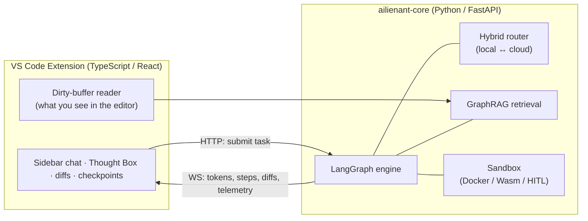
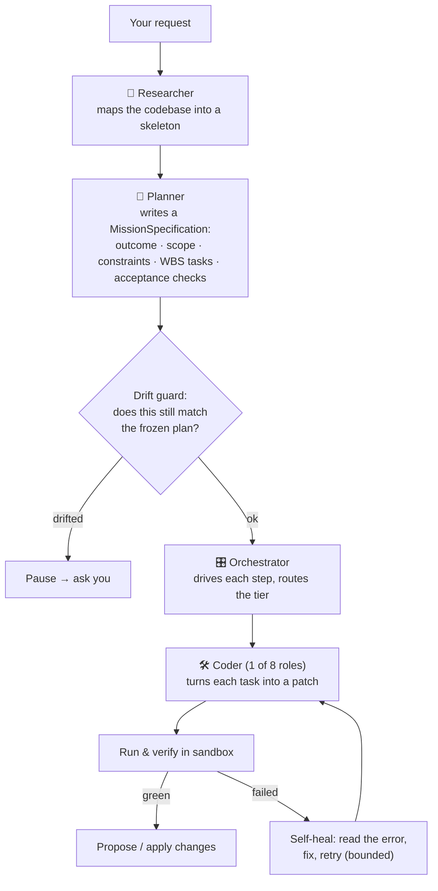
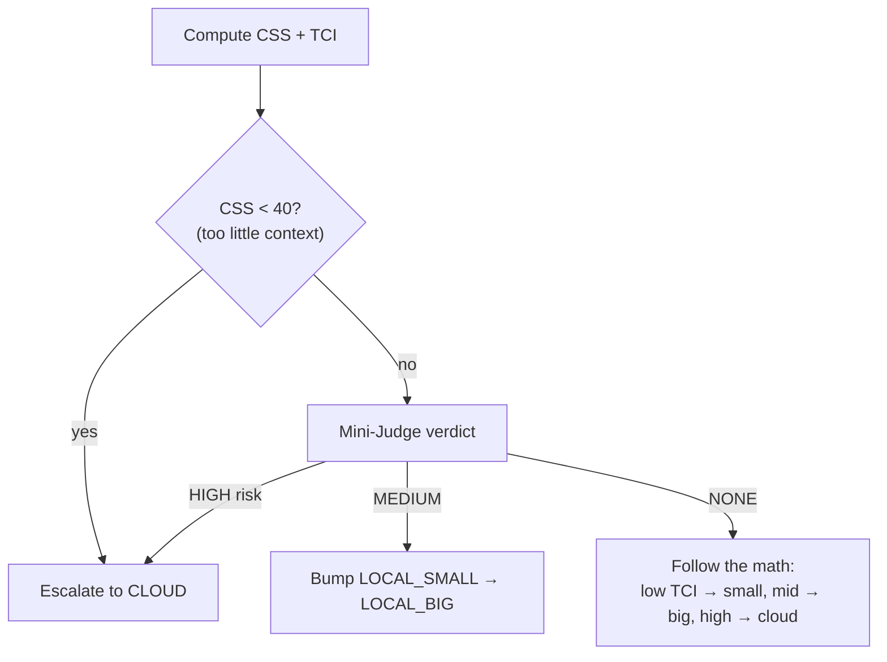
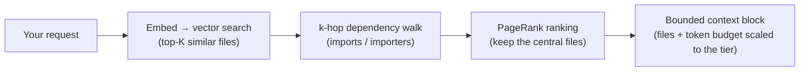
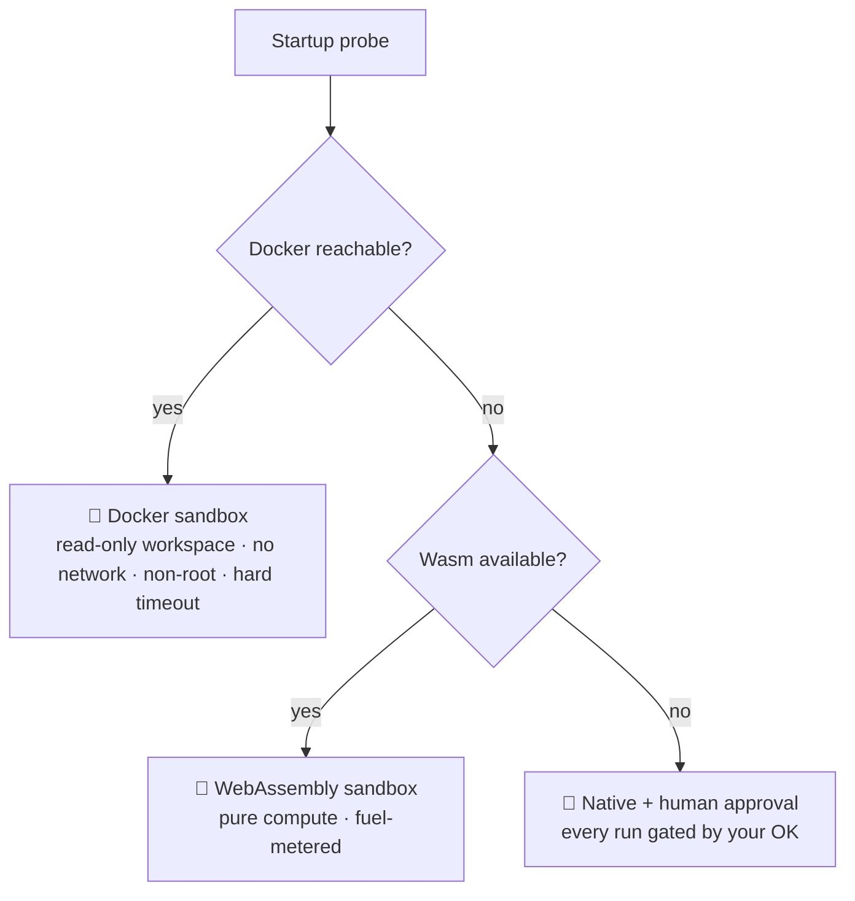
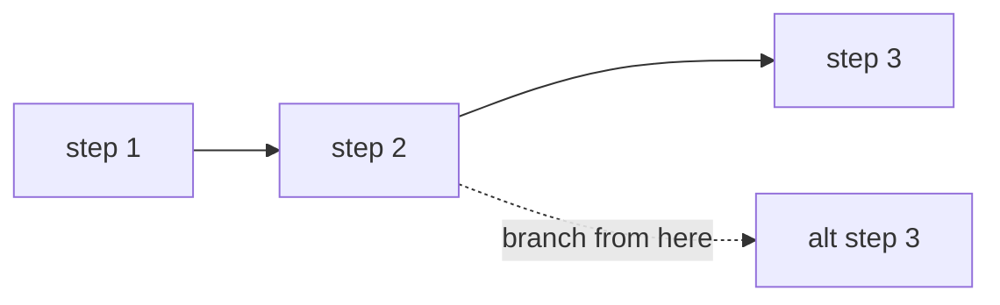
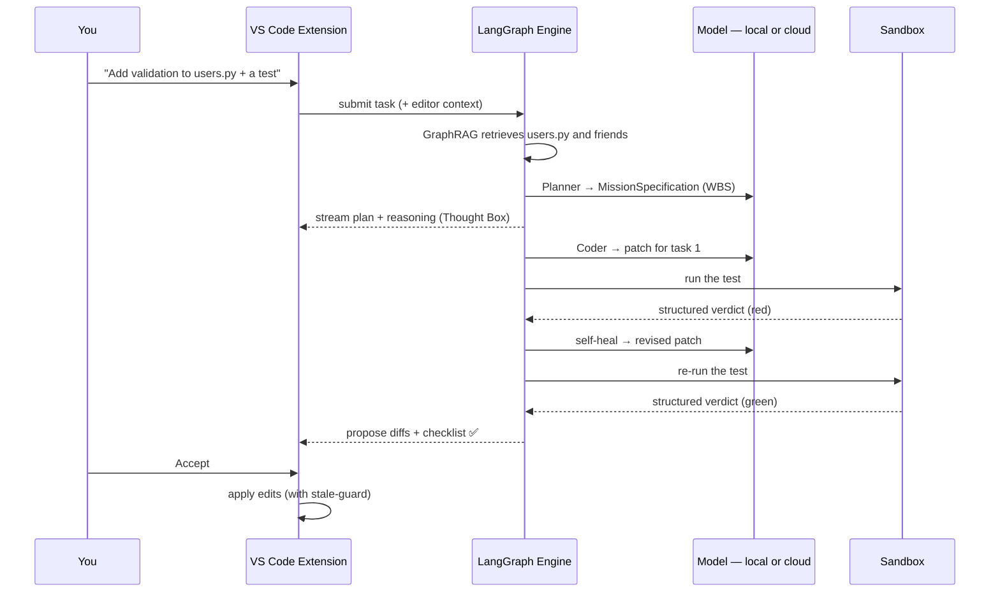

# How AILIENANT Works

This guide explains the machinery behind AILIENANT — the team of agents, how it decides between local and cloud models, how it finds the right code, how it runs and verifies that code safely, how it improves itself while you're away, and how it stays auditable. It's written for the technically curious; you don't need to be an AI engineer.

> For a gentler overview, see the [README](README.md). For the full internals — code maps, pseudocode, exact contracts — see [DEVELOPERS.md](DEVELOPERS.md).

---

## The big picture

AILIENANT has two halves that talk over HTTP and WebSocket:



- The **extension** is a thin client: it captures what's in your editor, shows the agent's work, and lets you approve changes.
- The **Core** does the thinking: it runs a stateful graph of steps, routes each step to the right model, retrieves code, executes commands in a sandbox, and streams everything back.

---

## The agent team

Most assistants use one model for everything. AILIENANT splits the work across a small team of specialists, because *understanding the code*, *deciding what to do*, *doing it*, and *explaining it* are different skills. They are wired together by a stateful **LangGraph** engine.



The five agents, in pipeline order:

- **🔭 Researcher** builds a *skeleton map* of the codebase — signatures, types, and cross-module relationships — so the Planner reasons over real structure rather than guesses. *(Emerging: today its skeleton is consumed as optional context by the Planner; it is being promoted to a first-class pipeline node.)*
- **🧭 Planner** never writes code. It converts your prompt into a strict, structured plan — a `MissionSpecification` with an explicit scope and a Work Breakdown Structure (WBS). The first plan is **frozen**.
- **🎛️ Orchestrator** drives the plan step by step — coordinating state, sequencing the WBS, and routing each step to the right model tier. *(Its introspection is now exposed as audited, callable tools — `get_wbs_status`, `emit_hitl_request`, `read_token_ledger` — see the catalog below.)*
- **🛠️ Coder** takes one task at a time and emits a patch in a git-conflict-style SEARCH/REPLACE format, validated before it ever touches disk. It adopts the **expert role** the task needs (below).
- **💬 Analyst (Natt)** is the read-only tutor you chat with in the side panel. It explains your code and AILIENANT itself, grounded in three context sources (the code graph, your workspace README, and AILIENANT's own product docs), but it **never edits files** — the *voice*, not the *hand*.

Around them runs a **safety & execution mesh** of deterministic nodes: a **drift guard** that compares every re-plan against the frozen baseline and escalates instead of quietly rewriting things; a **self-healing** unit that, on a fresh in-budget failure, reads the error and proposes a corrective patch before giving up; an **agentic cell** (a bounded ReAct loop over a live terminal) for steps that need real iteration; a **contract guard** (read-before-write), a **FinOps supervisor** (budget ceiling), and an **output validator** (AST + lint) on the write path.

### The Coder's 8 expert roles

A single "coder" prompt is a generalist. AILIENANT instead loads the role the task calls for — each with its own system prompt, tool allow-list, forbidden patterns, and human-approval triggers:

| Role | Focus | Notable guardrail |
| --- | --- | --- |
| **core_dev** | Business logic; prefer existing utilities over new abstractions | — |
| **architect_refactor** | SOLID refactors via coordinated multi-file edits | Must use batch edits; no full-file rewrites |
| **devops_infra** | Docker / CI / shell work | Any `sudo` or `.env` change pauses for your approval |
| **secops** | Security hardening; OWASP Top-10 | Runs Bandit/Semgrep after a patch; quotes CVE IDs |
| **qa_tester** | Tests first | Never marks a step done without a green test run |
| **doc_manager** | Docstrings, JSDoc, `.md` files only | Shell disabled; writes no business logic |
| **vcs_manager** | Git operations; Conventional Commits | Never force-pushes without approval |
| **data_ml_engineer** | Tensors, pipelines, analytics | Validates dataframe shapes before writing |

All roles share a base prompt and a language-mirroring directive (it answers in the language you write in). An unknown role safely defaults to `core_dev`.

---

## How it decides: local vs. cloud routing

AILIENANT doesn't send everything to an expensive cloud model. For each task it computes two scores and picks the cheapest tier that can do the job well.

- **Context Sufficiency Score (CSS)** — *do we have enough of the right code in context?*
  `CSS = (0.5 · semantic_similarity + 0.3 · graph_coverage + 0.2 · recency) × 100`
- **Task Complexity Index (TCI)** — *how hard is this task?*

A cheap **Mini-Judge** model then sanity-checks the decision:



The result is that simple, well-understood edits stay on a fast local model, while genuinely hard or under-specified tasks get the firepower they need — and you can see, in the token ledger, exactly when cloud was used and what it cost.

---

## How it finds the right code: GraphRAG

Before planning or coding, AILIENANT retrieves the files that matter — and, crucially, **only** those. Dumping whole files into the prompt is what makes other assistants slow, expensive, and impossible to run on a small local model. AILIENANT instead combines three techniques:

1. **Vector search.** One embedding call against a [LanceDB](https://lancedb.com/) index returns the top-K files most semantically similar to your request.
2. **Dependency expansion.** Those seed files are expanded through a SQLite dependency graph, so the agent also sees the things they import and are imported by — parsed with [Tree-sitter](https://tree-sitter.github.io/) for 20+ languages.
3. **Importance ranking.** The expanded set is ranked by **Personalized PageRank (PPR)** over the dependency graph, so the most structurally central files survive the budget and the peripheral ones are dropped first.



The hop depth, file count, and token budget all **scale with the routing tier**, so context always fits the model that will read it:

| Tier | Hops | Max files | Token ceiling |
| --- | --- | --- | --- |
| **LOCAL_SMALL** | 1 | 10 | 4,096 |
| **LOCAL_BIG** | 1 | 20 | 16,384 |
| **CLOUD** | 3 | 50 | 32,768 |

The payoff is concrete: across intents this retrieval targets a **~70 % mean reduction in prompt size** versus naïve file-dumping (an enforced gate, not an aspiration). That's the single biggest reason AILIENANT runs well on modest hardware — a 4 K-token local window is enough when the context is this precisely chosen. Everything is filtered by a per-workspace hash, so one project's code can never leak into another's.

A **Cognitive Fast-Boot** optimization skips the embedding call entirely on a warm start: after a successful plan, the mission state is written to `.ailienant/AGENTS.md`, and if that file is fresh (< 1 hour) on the next launch, retrieval reuses it.

---

## How it runs code safely: the sandbox

When the agent needs to run a command or a test, it never runs it blindly on your machine. A **sandbox adapter** is chosen at startup by probing what's available, in order of safety:



The closed **execute → verify → fix** loop is what makes the agent reliable: it runs the command, reads a *structured* verdict (not raw stdout it might misread), and if the verdict is red it enters a bounded self-healing loop — read the error, propose a fix, re-run — until it's green or it honestly gives up. For steps that need real iteration, AILIENANT runs an **agentic cell**: a small, bounded ReAct loop over a **live, persistent terminal** — a real shell session that keeps its working directory and environment across commands, streams output as it happens, and can be interrupted — where each iteration is its own checkpoint.

---

## How agents act: the tool catalog

Agents never touch your system directly — they act through a **typed, role-gated tool registry**. Each tool declares a privilege tier (`READ_ONLY` → `WRITE` → `EXECUTE` → `DANGEROUS`) and an allow-list of which agent roles may call it, both enforced at dispatch. Tools available today:

| Tool | Tier | Used by | What it does |
| --- | --- | --- | --- |
| `inspect_ast_node` | READ_ONLY | Coder roles, Researcher, Analyst, Planner | Extract the source of a class/function by name |
| `get_symbol_references` | READ_ONLY | Coder roles, Researcher, Analyst | Find files that import a target (1-hop backward) |
| `trace_data_flow` | READ_ONLY | Coder roles, Researcher, Analyst | Forward/backward k-hop reachability over the dep graph |
| `document_parser` | READ_ONLY | Coder roles, Researcher | Parse PDF / CSV / DOCX without disk I/O |
| `web_fetch` | READ_ONLY | Coder roles, Analyst | Fetch a URL and convert HTML → Markdown |
| `read_file` | READ_ONLY | Researcher + all roles | Paginated VFS read (RAM-first, firewall-enforced) |
| `glob` | READ_ONLY | Researcher | List workspace files matching an fnmatch pattern (VFS RAM ∪ indexed catalog) |
| `grep` | READ_ONLY | Researcher | Regex search over workspace file contents (RAM-first, O(max_matches) short-circuit) |
| `workspace_structure` | READ_ONLY | Researcher, Planner | Relevance-filtered directory tree over the VFS ∪ catalog universe |
| `query_graphrag` | READ_ONLY | Researcher | Expand seed files via the GraphRAG graph and return a compact context block |
| `get_dependents` | READ_ONLY | Researcher, Planner | JSON list of files that import the given file (1-hop backward, structured output) |
| `run_linter` | READ_ONLY | Analyst | ruff (Python) / eslint (TS) diagnostics; cascade RAM→disk read; degrades gracefully |
| `analyze_complexity` | READ_ONLY | Analyst | McCabe CC + nesting depth + per-function breakdown for Python files (100 KB cap) |
| `audit_dependencies` | READ_ONLY | Analyst | Parse requirements.txt / pyproject.toml / package.json; optional CVE lookup via injectable search |
| `diff_changes` | READ_ONLY | Analyst | Unified diff of in-RAM dirty buffer vs on-disk original; new-file aware; capped at 300 lines |
| `web_search` | READ_ONLY | Analyst | Web search via injectable provider (brave-search MCP compatible); degrades when unconfigured |
| `read_token_ledger` | READ_ONLY | Analyst, Orchestrator | Live token-cost snapshot from TokenLedger (local / cloud / all tiers) |
| `get_wbs_status` | READ_ONLY | Orchestrator | Aggregate + per-step view of the live mission WBS (status counts, active step; 200-step cap) |
| `emit_hitl_request` | READ_ONLY | Orchestrator | Raise an audited, idempotent HITL approval gate (deterministic id; injection-sanitized flag) |
| `validate_wbs_dependencies` | READ_ONLY | Planner | Pre-commit WBS gate: detects forward-reference ordering violations and out-of-scope target files (200-step cap; path boundary via `PurePosixPath.is_relative_to`) |
| `estimate_plan_budget` | READ_ONLY | Planner | Heuristic token-cost estimate for a committed mission plan vs session budget; advisory — never raises, stores result via LangGraph reducer (shift-left of OOM fallback) |
| `atomic_code_patch` | WRITE | all coder roles except vcs_manager (apply_patch holders) | Fuzzy search/replace with AST + optimistic-concurrency check |
| `batch_semantic_edit` | WRITE | architect_refactor | Multi-file coordinated edit, ACID via unit-of-work |
| `file_write` | WRITE | core_dev, devops_infra, doc_manager, data_ml | Create/overwrite a VFS file with AST + OCC |
| `sandbox_bash` | EXECUTE | devops_infra, qa_tester, vcs_manager, data_ml (BashTool holders) | Short-lived shell command in the sandbox (HITL-gated) |
| `run_tests` | EXECUTE | qa_tester | Run pytest against a project-relative target (`-q -- <target>`; flag/traversal-guarded) |
| `git_stage` | EXECUTE | vcs_manager | `git add` of `List[str]` project-relative paths (each arg guarded + quoted) |
| `git_commit` | EXECUTE | vcs_manager | Commit from validated parts; Conventional-Commit composed conditionally (no `feat(): …`) |
| `git_diff` | EXECUTE | vcs_manager | On-disk git diff (worktree/staged). Does NOT show RAM-VFS pending edits — use `diff_changes` |
| `generate_docstring` | WRITE | doc_manager | AST-anchored docstring stub insertion; catches `SyntaxError`/`RecursionError` (never crashes) |
| `linter_autofix` | EXECUTE | secops, qa_tester | ruff `--diff` (default) or `--fix`; diff-before-apply |
| `install_dependency` | EXECUTE | devops_infra | pip install of a strictly-validated package/version (anchored regex; no URLs/VCS refs) |
| `guard_env_file` | DANGEROUS | devops_infra | Intercepts `.env`/`.env.*` mutations → content-hash-idempotent HITL gate; never writes secrets |
| `run_data_pipeline` | EXECUTE | data_ml | Run a project-relative pipeline script in the sandbox (arg-guarded) |
| `security_audit` | READ_ONLY | secops | Pure-Python OWASP scan over a diff/code string (secrets, eval/exec, shell=True, pickle, yaml.load, dynamic SQL) |
| `validate_ast` | READ_ONLY | all coder roles except vcs_manager | Structural AST validation (Python `ast.parse`, TS/TSX engine); `{is_valid, errors}` |
| `task_create` | EXECUTE | exec-capable roles + orchestrator (V2) | Spawn a long-running background task |
| `check_type_integrity` | EXECUTE | exec-capable roles | Run `mypy` / `tsc` over a target |
| `task_get` | READ_ONLY | exec-capable roles + orchestrator (V2) | Read a background task's status/output |
| `run_benchmark` | EXECUTE | orchestrator, qa_tester, devops_infra | Reserve a single-flight slot and dispatch the benchmark harness; returns task_id |
| `get_benchmark_report` | READ_ONLY | orchestrator, qa_tester, devops_infra | Read benchmark run status + report via `asyncio.to_thread` (non-blocking disk I/O) |
| `list_capabilities` | READ_ONLY | orchestrator, planner | Return JSON array of the gateway's external capabilities (name, tier, async flag) |
| `skill_invoke` | READ_ONLY | orchestrator, planner | Resolve user-authored skills by explicit ID or auto-match against a task description |
| `task_list` | READ_ONLY | orchestrator | Snapshot of all background tasks (metadata only, raw output excluded, capped at 50) |
| `task_stop` | EXECUTE | orchestrator | Send SIGTERM to a running background task; cancel-wins race guard prevents status overwrite |
| `ask_user_question` | READ_ONLY | all roles, Orchestrator | Pause and surface a structured question to you |
| `toggle_plan_mode` | READ_ONLY | all roles, Orchestrator | Switch the session's permission mode |
| `tool_search` | READ_ONLY | all roles | Discover tools that aren't loaded — relevance-retrieve them by query so the prompt stays small as the catalog grows |

That's the foundation. The roadmap (**[División 8.8](docs/PROJECT_MANIFEST.md)**) expands it toward **~56 role-assigned tools**, organized as a tool × agent matrix — so the two context-building agents (Researcher and Analyst) everyone else depends on are no longer the least equipped. Highlights of what's planned (status ⏳):

| Agent | Planned tools (⏳) |
| --- | --- |
| 💬 **Analyst** | *(all 10 tools shipped — see live catalog above)* |
| 🎛️ **Orchestrator** | *(all tools shipped — see live catalog above; token telemetry reuses `read_token_ledger`)* |
| 🧭 **Planner** | *(all tools shipped — `validate_wbs_dependencies`, `estimate_plan_budget` + 3 wire-ins — see live catalog above)* |
| 🛠️ **Coder** *(by role)* | *(all shipped — 10 net-new role-exclusive tools + `validate_ast`, and the 4 formalize tools re-mirrored to roles.py — see live catalog above)* |
| 🔌 **Gateway/Benchmark** | *(all shipped — `run_benchmark`, `get_benchmark_report`, `list_capabilities`, `skill_invoke`, `task_list`, `task_stop` + Task V2 role expansion on `task_create`/`task_get` — see live catalog above)* |
| 🌐 **Universal** | `todo_write` |

The enabling piece, `tool_search`, **already ships** (the Wave 0 gate): rather than load every schema into the prompt, the engine injects the whole tool catalog only while it fits a small slice of the context budget — and once it would grow past that, it switches automatically to retrieving the few tools relevant to the step from a RAM-resident vector store, always keeping `tool_search` on hand so an agent can pull the rest by query. The prompt stays small no matter how large the catalog grows.

---

## Extending it: MCP servers & skills

AILIENANT has no bespoke "plugin" runtime — it extends through two open mechanisms instead:

- **MCP servers.** It speaks the **Model Context Protocol**. A curated **regulated registry** ships vetted servers — GitHub, Brave Search, Docker, Postgres — each with its install metadata and a per-tool privilege **tier map**. When a server connects, AILIENANT opens a stdio session, lists its tools, and harvests their schemas straight into the same role-gated registry and the `tool_search` store. Two safety rules apply: every MCP tool is **privilege-classified fail-closed** (unknown → DANGEROUS until proven otherwise, via a curated catalog → verb-heuristic → default chain), and the server command is checked against a **basename allow-list** to block command injection. After you approve a tool once, it's trusted for the rest of the session.
- **Skills.** Reusable instruction snippets — a prompt or command template you save once and reuse, either globally or scoped to a workspace. They live in the catalog DB (so concurrent edits don't clobber each other) and drop into any prompt. *(Invoking a skill as a first-class tool, `skill_invoke`, is on the 8.8 roadmap.)*

---

## How nothing gets lost: checkpoints

The engine is a **stateful graph**, and every transition between steps is written durably to SQLite (in WAL mode). That single design choice gives you several things at once:

- **Resume after a crash** — the run picks up where it stopped.
- **Time-travel** — branch a new session from any past checkpoint to try a different path.
- **Audit** — every step is a record you can inspect.



---

## How it plans before it codes: spec-driven development

Most AI coding tools go straight from prompt to edit. AILIENANT inserts a disciplined planning stage that produces a **frozen contract** before the first file is opened.

**The flow:**
```
intent
  → Planner (run_planner_node)
      → MissionSpecification (9 fields)
          → immutable_wbs freeze
              → Coder executes against the frozen spec
                  → drift_monitor watches for scope changes
```

**What's in a `MissionSpecification`** (`brain/state.py:138`):

| Field | What it enforces |
|-------|-----------------|
| `outcome` | The expected result and delivered value — the single source of truth for "done" |
| `scope` | Exact list of files in scope; anything not named is out of scope |
| `constraints` | Technical limits — no new external libs, complexity bounds, project conventions |
| `decisions` | Architectural choices adopted for this task; the Coder can't override them |
| `tasks` | The WBS: ordered `WBSStep` list with `target_file`, `action`, `target_role`, `requires_iteration` |
| `checks` | Acceptance criteria the output must satisfy before the task closes |
| `ubiquitous_language` | DDD domain terms extracted from a Socratic session — agent and human share a vocabulary |
| `deep_modules_sdd` | Architectural SDD narrative for core modules touched by this plan |
| `tdd_criteria` | Test-driven acceptance criteria wired directly to the validation step |

**Why the spec freezes:** On the first turn, the Planner writes `immutable_wbs` and never touches it again. All subsequent re-plans produce a new `mission_spec`, but the original remains the baseline. The `drift_monitor` node (`brain/drift_monitor.py`) runs after every planner call and computes a hybrid similarity score:

- 50 % — text similarity of outcome + task descriptions (SequenceMatcher)
- 30 % — Jaccard overlap of the target-file sets
- 10 % — task-count ratio
- 10 % — action-type overlap

If the score drops below **70 %**, the drift monitor opens a HITL approval gate (5-minute timeout). Approving resets the baseline to the new spec; rejecting propagates an error back to the agent. The agent cannot silently expand scope.

---

## How it recovers: the execution harness

The harness is the scaffold that prevents a node failure from becoming a session crash. Every agent turn passes through several deterministic layers before and after the LLM call.

**Reflexion guard** (`brain/engine.py`, `reflexion_guard` decorator):
The `coder_agent` node is wrapped in a decorator that intercepts any unhandled exception at the Python level. Instead of propagating the traceback, it produces a state delta: `{"healing_required": True, "failed_node": "coder_agent", "failure_signature": "<hash>", "last_error_trace": "..."}`. A circuit-breaker (`failure_breaker.allow()`) blocks routing the same failure signature twice. The graph's `route_after_coder` edge sends `healing_required=True` turns to the `error_correction` node instead of `contract_guard`.

**Error correction agent** (`agents/error_correction.py`):
Receives the traceback and the offending source. Extracts candidate files from traceback frames, caps content at 16 K chars, and proposes the **smallest corrective patch** that resolves the error. The patch flows through the normal HITL approval + write pipeline — the repair agent has no direct disk write access.

**Contract guard** (`agents/contract_guard.py`):
Runs after every successful coder turn. Mints a `SessionContract` when any of three triggers fires:

| Trigger | Condition |
|---------|-----------|
| `TCI_DELTA` | Task Complexity Index jumped > 15 points |
| `CSS_AT_CAPACITY` | Context Sufficiency Score < 40 % **and** token usage ≥ 80 % of window |
| `SUBGRAPH_SHIFT` | `target_role` changed between steps |

The contract is a structured LLM-generated record: `{mission_outcome, active_role, in_scope, out_of_scope, open_constraints, trigger_reason}`. It falls back to a deterministic skeleton on any LLM failure.

**FinOps gate** (`brain/finops.py`):
Runs on every super-step after `supervisor_node`. Reads `current_cost_usd` against `max_budget_usd`. Under budget: zero-cost pass-through. Over budget: opens a HITL approval gate (120-second timeout). On timeout: routes to END — the gate fails safe rather than silently burning budget.

**Dead-letter queue:**
Seven nodes are wrapped with `dead_letter_decorator`. On an unhandled exception, the decorator promotes the current L1 (in-memory) checkpoint to L2 (SQLite WAL) before re-raising. This means the session state at the point of failure is durable — you can resume or branch from the last good checkpoint rather than starting over.

---

## How it stays honest: the safety & audit model

Security isn't a bolt-on; it's woven through the engine.

| Concern | How AILIENANT handles it |
| --- | --- |
| **Unknown tools** | A fail-closed classifier rates every tool's privilege. Anything unrecognized is treated as **dangerous** until explicitly allowed. |
| **Risky actions** | Routed through a 3-axis permission check (session mode × tool privilege × agent identity) that returns *allow / ask / deny*. |
| **Blind edits** | A read-before-write rule blocks writing to a file the agent hasn't actually read. |
| **Concurrent edits** | Optimistic concurrency: if you change a file while the agent is working on it, the stale patch is caught instead of clobbering your work. |
| **Spending** | A deterministic FinOps supervisor enforces a hard budget ceiling and a soft approval gate. |
| **Accountability** | Every human approval is appended to a blake2b-chained audit ledger you can verify end-to-end. |
| **Privacy** | `.gitignore` / `.ailienantignore` are honored; binary and oversized files are skipped; secrets are scrubbed from logs. |

---

## Memory you can see

The GraphRAG index is not a black box. The dashboard's **Memory** panel renders it as an interactive **knowledge graph**: a force-directed view of your files (nodes) and their dependencies (edges), where the most-connected "hub" files are scaled up, modules in the same cluster share a color, and a node's importance (PageRank) pulls it toward the center. A second view projects the *semantic* embeddings into a 2D map (PCA), so you can literally see which parts of the code the engine considers related. The graph is served over plain HTTP (`GET /api/v1/memory/graph`, `/vectors`) — a living picture of what the agent knows and why it reads what it reads.

---

## How it improves while you're away: Dreaming

Coding happens in bursts. You break for lunch; you log off for the night. **Dreaming** turns that idle time into autonomous, self-taught improvement — and it's built around one deliberate principle: **you decide when the resources are spent.**

### Why it's on-demand, not a timer

A naïve "background AI" wakes itself on a schedule. AILIENANT explicitly **rejects** that: an idle trigger that fired GraphRAG + an LLM mid-build would peg your CPU, race a typist who just came back, and burn tokens unattended. So Dreaming **never wakes on a timer**. You start it when you step away — the moment you know the machine is free. That single choice is what makes unattended autonomy safe.

### What a pass actually does

A consolidation pass is **strictly read-only — it never edits your files.** It:

1. Reads a hard-bounded **workspace overview** (a skeleton, not the whole repo).
2. Asks the model to distill **durable architectural facts, recurring patterns, and latent technical debt** into a compact note — optionally scoped to a **focus** you choose (*Architecture & Patterns*, *Refactoring & Technical Debt*, *Bug Fixes*, the whole workspace, or a theme you type). A focus spends fewer tokens and aims the pass at what you care about.
3. Writes the result into **long-term semantic memory** (`.ailienant/dreams/<focus>.md`), so every future task starts better-informed. Re-running a focus upserts in place.

Three safety rails wrap every pass: a **FinOps gate** refuses to start once the session's spend ceiling is hit (Dreaming is genuinely token-hungry); the network call happens **outside** the project's write-lock, which guards only the final write; and an **optimistic-concurrency check** aborts the pass without writing if you come back and save a file mid-run. It also **stops on its own if errors compound** rather than thrashing.

### Choosing a profile

Match the profile to the break you're taking — they trade speed, cost, and depth. The model used comes from your active BYOM preset:

| Profile | Engine | Limits | Best for |
| --- | --- | --- | --- |
| **Medium** | Local *medium* model | 1 task · 3 files · ~60 min | A lunch break — light, fully local, **zero cloud cost**; keep memory fresh + small consolidations |
| **Big** | Local *big* model | 3 tasks · 10 files · nightly | Overnight — deeper exploration and tech-debt mapping, still **no cloud spend** |
| **Cloud** | Cloud model | 1 task · 5 files · token-capped | Top-tier reasoning on a focused area, with a **hard token cap** so cost stays predictable |
| **Hybrid** | Cloud *plans* + local *edits* | 2 tasks · 6 files | The cost/quality sweet spot: a cloud model does the thinking, a local model does the work |

### The offline tree-search (MCTS)

Beyond consolidating memory, the deeper Dreaming profiles explore **candidate improvements** with a Monte-Carlo Tree Search. The loop is cost-aware by construction: it generates variants with a **cheap local model**, tries to repair a failing variant locally (bounded retries), and **escalates to a stronger "surgeon" model only when it's genuinely stuck** (after a streak of failures). A final reward judge keeps only changes that actually pass. The result is self-correcting exploration that spends expensive tokens only where local effort has demonstrably failed. *(This MCTS daemon is in active development; the on-demand memory-consolidation pass above is the part you can run today.)*

---

## Putting it together: the life of a task



---

## Where to go next

- **[HowToUseIt.md](HowToUseIt.md)** — put all of this into practice.
- **[DEVELOPERS.md](DEVELOPERS.md)** — the same machinery at full technical depth: module map, pseudocode, contracts, and the honest list of what isn't built yet.
- **[docs/PROJECT_MANIFEST.md](docs/PROJECT_MANIFEST.md)** — the roadmap.
