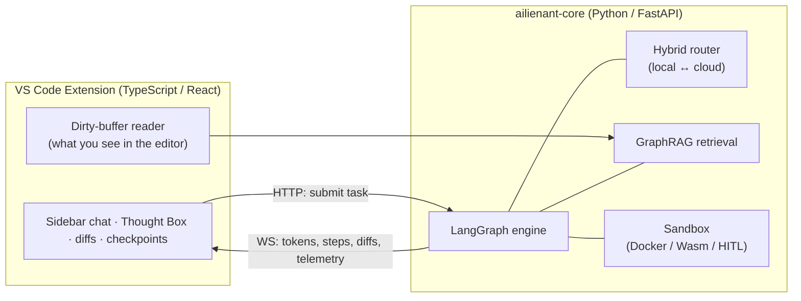
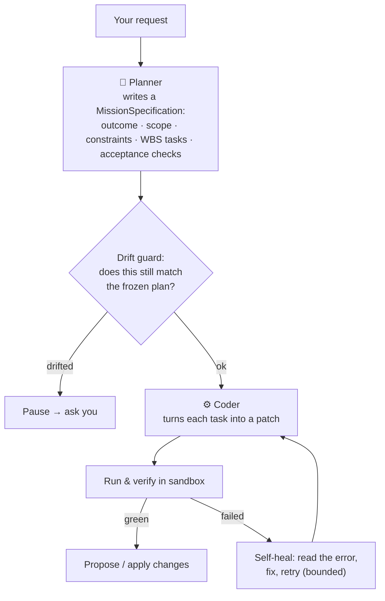
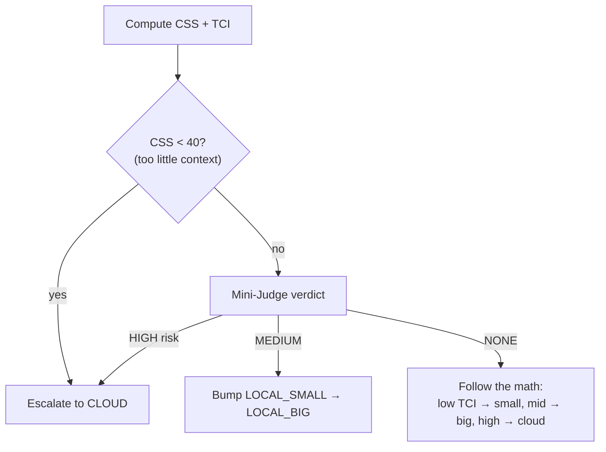
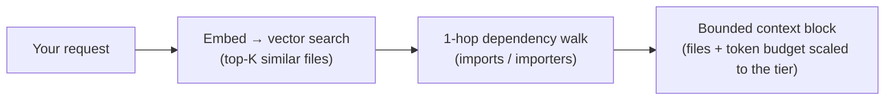
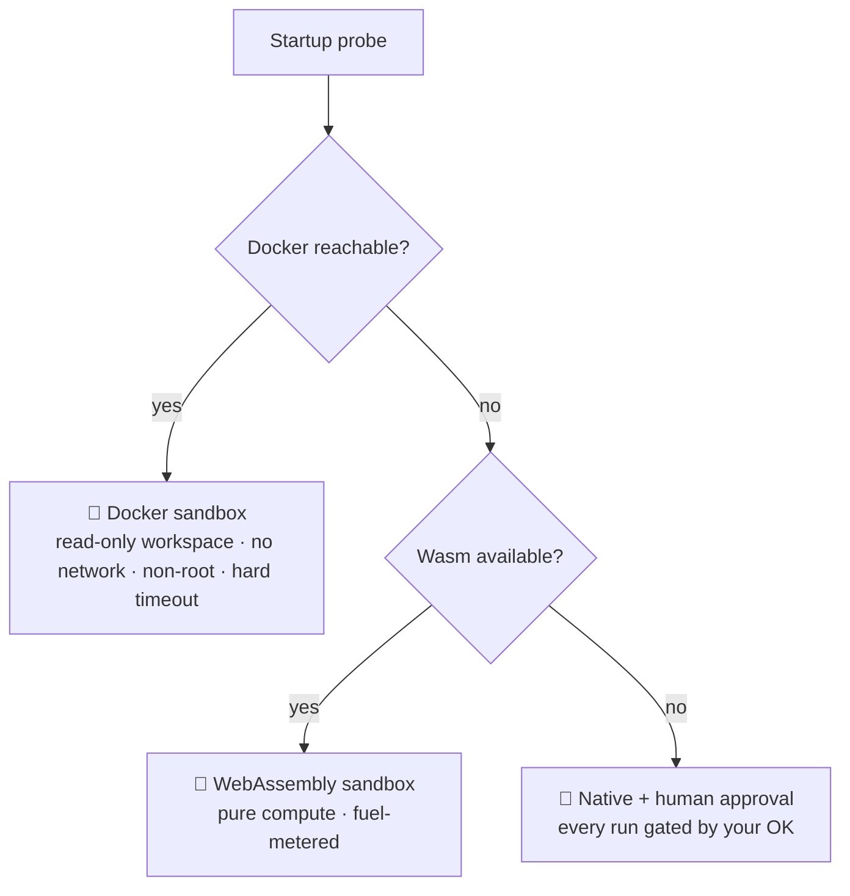
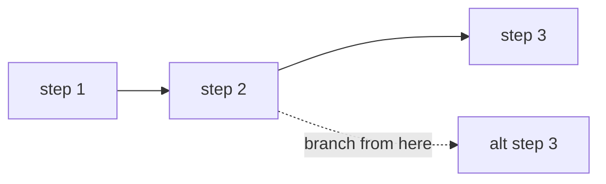

# How AILIENANT Works

This guide explains the machinery behind AILIENANT — the two-headed engine, how it decides between local and cloud models, how it finds the right code, how it runs and verifies that code safely, and how it stays auditable. It's written for the technically curious; you don't need to be an AI engineer.

> For a gentler overview, see the [README](README.md). For the full internals — code maps, pseudocode, exact contracts — see [DEVELOPERS.md](DEVELOPERS.md).

---

## The big picture

AILIENANT has two halves that talk over HTTP and WebSocket:



- The **extension** is a thin client: it captures what's in your editor, shows the agent's work, and lets you approve changes.
- The **Core** does the thinking: it runs a stateful graph of steps, routes each step to the right model, retrieves code, executes commands in a sandbox, and streams everything back.

---

## The two-headed engine: Planner and Coder

Most assistants use one model for everything. AILIENANT splits the job in two, because *deciding what to do* and *doing it* are different skills.



- **The Planner** never writes code. It converts your prompt into a strict, structured plan — a `MissionSpecification` with an explicit scope and a Work Breakdown Structure (WBS). The first plan is **frozen**.
- **The drift guard** compares every later re-plan against that frozen baseline. If the agent starts to wander outside the agreed scope, it stops and escalates to you instead of quietly rewriting things.
- **The Coder** takes one task at a time and emits a patch in a git-conflict-style SEARCH/REPLACE format, validated before it ever touches disk.

---

## How it decides: local vs. cloud routing

AILIENANT doesn't send everything to an expensive cloud model. For each task it computes two scores and picks the cheapest tier that can do the job well.

- **Context Sufficiency Score (CSS)** — *do we have enough of the right code in context?*
  `CSS = (0.5 · semantic_similarity + 0.3 · graph_coverage + 0.2 · recency) × 100`
- **Task Complexity Index (TCI)** — *how hard is this task?*

A cheap **Mini-Judge** model then sanity-checks the decision:



The result is that simple, well-understood edits stay on a fast local model, while genuinely hard or under-specified tasks get the firepower they need — and you can see, in the token ledger, exactly when cloud was used and what it cost.

---

## How it finds the right code: GraphRAG

Before planning or coding, AILIENANT retrieves the files that matter. It combines two techniques:

1. **Vector search.** One embedding call against a [LanceDB](https://lancedb.com/) index returns the top-K files most semantically similar to your request.
2. **Dependency expansion.** Those seed files are expanded **one hop** through a SQLite dependency graph, so the agent also sees the things they import and are imported by — parsed with [Tree-sitter](https://tree-sitter.github.io/) for 20+ languages.



The depth, file count, and token budget all **scale with the routing tier** — a small local task gets a tight context; a cloud task gets a wide one. Everything is filtered by a per-workspace hash, so one project's code can never leak into another's.

A **Cognitive Fast-Boot** optimization skips the embedding call entirely on a warm start: after a successful plan, the mission state is written to `.ailienant/AGENTS.md`, and if that file is fresh (< 1 hour) on the next launch, retrieval reuses it.

---

## How it runs code safely: the sandbox

When the agent needs to run a command or a test, it never runs it blindly on your machine. A **sandbox adapter** is chosen at startup by probing what's available, in order of safety:



The closed **execute → verify → fix** loop is what makes the agent reliable: it runs the command, reads a *structured* verdict (not raw stdout it might misread), and if the verdict is red it enters a bounded self-healing loop — read the error, propose a fix, re-run — until it's green or it honestly gives up. For steps that need real iteration, AILIENANT runs an **agentic cell**: a small, bounded ReAct loop over a live terminal, where each iteration is its own checkpoint.

---

## How nothing gets lost: checkpoints

The engine is a **stateful graph**, and every transition between steps is written durably to SQLite (in WAL mode). That single design choice gives you several things at once:

- **Resume after a crash** — the run picks up where it stopped.
- **Time-travel** — branch a new session from any past checkpoint to try a different path.
- **Audit** — every step is a record you can inspect.



---

## How it stays honest: the safety & audit model

Security isn't a bolt-on; it's woven through the engine.

| Concern | How AILIENANT handles it |
| --- | --- |
| **Unknown tools** | A fail-closed classifier rates every tool's privilege. Anything unrecognized is treated as **dangerous** until explicitly allowed. |
| **Risky actions** | Routed through a 3-axis permission check (session mode × tool privilege × agent identity) that returns *allow / ask / deny*. |
| **Blind edits** | A read-before-write rule blocks writing to a file the agent hasn't actually read. |
| **Concurrent edits** | Optimistic concurrency: if you change a file while the agent is working on it, the stale patch is caught instead of clobbering your work. |
| **Spending** | A deterministic FinOps supervisor enforces a hard budget ceiling and a soft approval gate. |
| **Accountability** | Every human approval is appended to a blake2b-chained audit ledger you can verify end-to-end. |
| **Privacy** | `.gitignore` / `.ailienantignore` are honored; binary and oversized files are skipped; secrets are scrubbed from logs. |

---

## Putting it together: the life of a task

```mermaid
sequenceDiagram
  participant You
  participant Ext as VS Code Extension
  participant Core as LangGraph Engine
  participant LLM as Model (local/cloud)
  participant Box as Sandbox

  You->>Ext: "Add validation to users.py + a test"
  Ext->>Core: submit task (+ editor context)
  Core->>Core: GraphRAG retrieves users.py & friends
  Core->>LLM: Planner → MissionSpecification (WBS)
  Core-->>Ext: stream plan + reasoning (Thought Box)
  Core->>LLM: Coder → patch for task 1
  Core->>Box: run the test
  Box-->>Core: structured verdict (red)
  Core->>LLM: self-heal → revised patch
  Core->>Box: re-run the test
  Box-->>Core: structured verdict (green)
  Core-->>Ext: propose diffs + checklist ✅
  You->>Ext: Accept
  Ext->>Ext: apply edits (with stale-guard)
```

---

## Where to go next

- **[HowToUseIt.md](HowToUseIt.md)** — put all of this into practice.
- **[DEVELOPERS.md](DEVELOPERS.md)** — the same machinery at full technical depth: module map, pseudocode, contracts, and the honest list of what isn't built yet.
- **[docs/PROJECT_MANIFEST.md](docs/PROJECT_MANIFEST.md)** — the roadmap.
